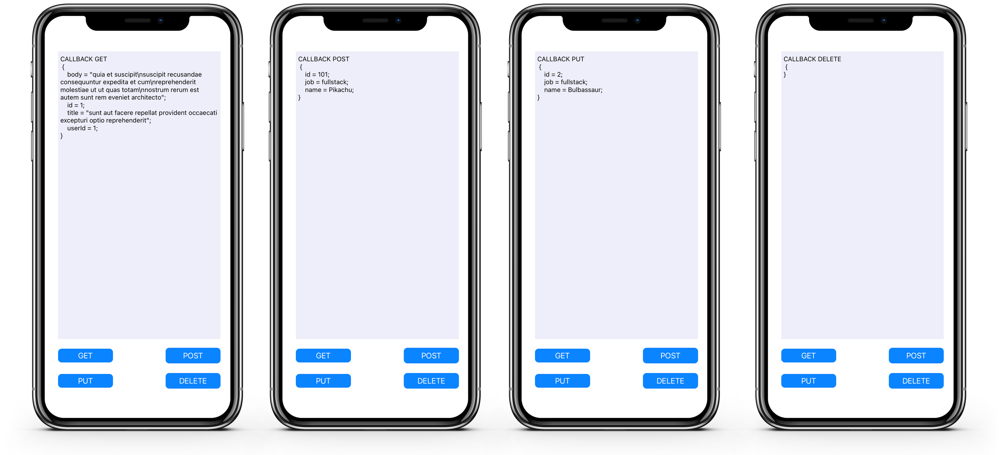

# objchttp

[](https://cocoapods.org/pods/objchttp)
[](https://cocoapods.org/pods/objchttp)
[](https://cocoapods.org/pods/objchttp)
[](https://cocoapods.org/pods/objchttp)


## How to use in objC

### Common HTTP Requests 
<br/>
To use objchttp you have to implement an object of the class httpReques iniciating that object with the schema `http or https` and the `host`, following this example:

```
httpRequest * requester = [httpRequest alloc];
requester.schema = @"https";
requester.host = @"://jsonplaceholder.typicode.com";
```

To make the http call simply use that object with the method you what, in the following example its a `GET` call

```
[requester fetchData: @"/posts/1"
          completion:^(NSString * result) {
    [self printString: result];
}];
```

 Where `fetchData` is the name of the function, them you pass the endpoint of the API and a completion, in this case we are calling the `printString` function from our ViewController.
 The result in question is a NSString containing a JSON Object with the response.
 
There is four simple http requests, being : 

* fetchData : for the GET method.
* postData : for the POST method.
* putData : for the PUT method.
* deleteData : for the DELETE method.

In the `postData` and the `putData` functions you also have to pass a dictionary containing the body of your http request, see the following example to see how can you do it.

```
NSMutableDictionary *uDictionary = [[NSMutableDictionary alloc] init];
[uDictionary setValue:@"Rogrido" forKey:@"name"];
[uDictionary setValue:@"iOS Developer" forKey:@"job"];
```

And the function looks like this

```    
[requester postData:uDictionary :@"/posts" completion:^(NSString * result) {
[self printString: result];
}];
```

Where `uDictionary` is a NSMutableDictionary where you will pass the json and `@"/posts"` is the endpoint for the request. 

### Custom HTTP Requests

The method `requestWithMethod` you can pass the method to the request
```
[requester requestWithMethod:@"POST" :@"/posts" completion:^(NSString * result) {
    [self printString: result];
}];
```
Where `requestWithMethod` is the name of the function ,`@:"POST"` is the method and `@"/posts"` is the endpoint, them you pass the endpoint of the API and a completion, in this case we are calling the `printString` function from our ViewController.
The result here is a NSString containing a JSON Object with the response.

The method `requestWithMethod` you can pass the method to the request and a body to the function
```
[requester requestWithMethodAndBody:@"POST":uDictionary:@"/posts" completion:^(NSString * result) {
  [self printString: result];
}];
```
Where `requestWithMethodAndBody` is the name of the function ,`@:"POST"`  is the method , `uDictionary` is a NSMutableDictionary with the JSON Object and `@"/posts"` is the endpoint, them you pass the endpoint of the API and a completion, in this case we are calling the `printString` function from our ViewController.
The result will be a NSString containing a JSON Object with the response.

<br/> 

## How to use in Swift

### Common HTTP Requests
<br/>

To use objchttp you have to implement an object of the class httpRequest

```
var request: httpRequest?
```

Iniciating that object with the schema `http or https` and the `host`, following this example on `viewDidLoad()`

```
  request = httpRequest()
  request?.schema = "https"
  request?.host = "://jsonplaceholder.typicode.com"
```
To make the http call simply use that object with the method you what, in the following example its a `GET` call

```
  request?.fetchData("/posts/1", completion: { result in
      DispatchQueue.main.async {
          self.getTextView.text = "CALLBACK GET 🚀\n\(result!)"
      }
      print("CALLBACK GET\n", result!)
  })
  
```
In the `postData` and the `putData` functions you also have to pass a dictionary containing the body of your http request, how to objC, see the following example to see how can you do it.

```
    let dict = NSMutableDictionary(object: "Alley", forKey: "name" as NSCopying)
    dict.setValue("ios dev", forKey: "job")
```
And get post request for this example:

```
    request?.postData(dict, "/posts", completion: { result in
        DispatchQueue.main.async {
            self.getTextView.text = "CALLBACK POST 🚀\n\(result!)"
        }
    })

```

### Custom HTTP Requests

The method `requestWithMethod` you can pass the method to the request like objC

```
  request?.request(withMethod: "GET", "/posts/", completion: { result in
      DispatchQueue.main.async {
          print("Request With Method\n", result!)
      }
  })
```

## Example

To run the example project, clone the repo, and run `pod install` from the Example directory first.

## Requirements

objchttp is available through [CocoaPods](https://cocoapods.org). Install CocoaPods if not already available:

``` bash
$ [sudo] gem install cocoapods
$ pod setup
```

## Installation

Go to the directory of your Xcode project, and Create and initialize your podfile:

``` bash
$ cd /path/to/MyProject
$ pod init

Edit your Podfile and add objchttp:

target 'MyProject' do
pod 'objchttp', :git => 'https://github.com/PhoenixPassenger/objchttp.git'
end
```

Install into your project:

``` bash
$ pod install
```

Open your project in Xcode from the .xcworkspace file (not the usual project file)

``` bash
$ open MyProject.xcworkspace
```


## Screenshots

</br>



## Author

32482081, Rodrigo.ato@hotmail.com

## License

objchttp is available under the MIT license. See the LICENSE file for more info.
